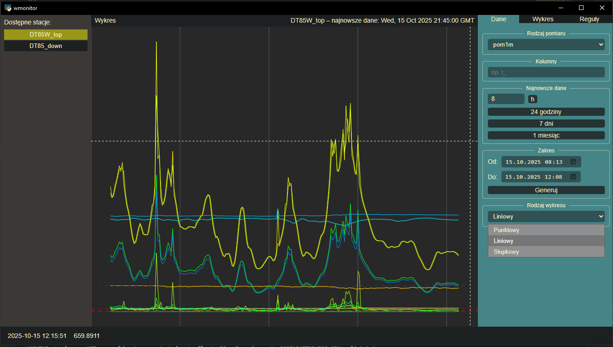
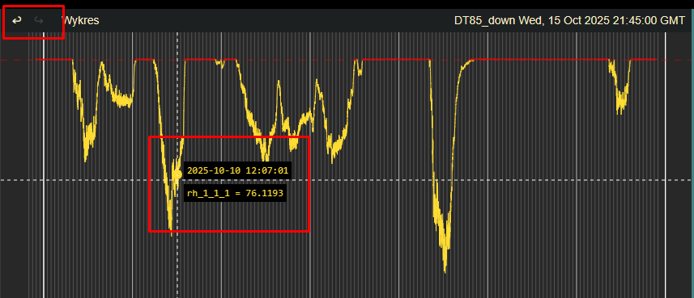
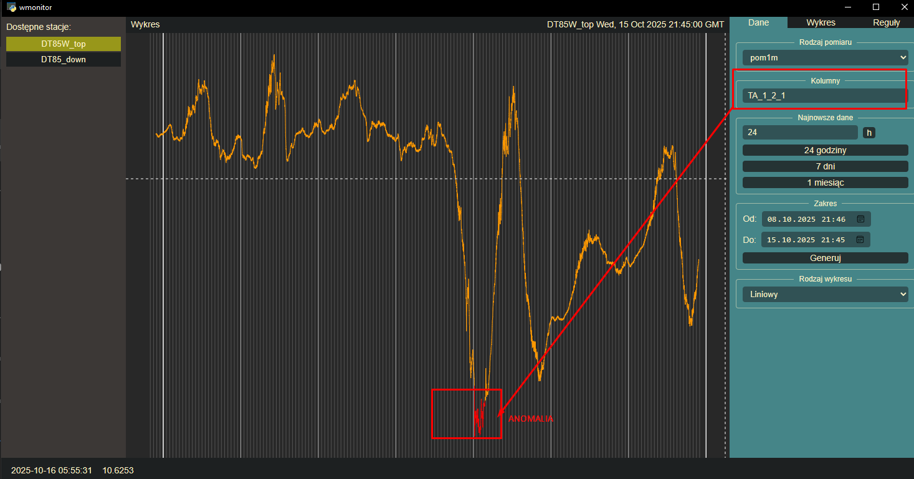
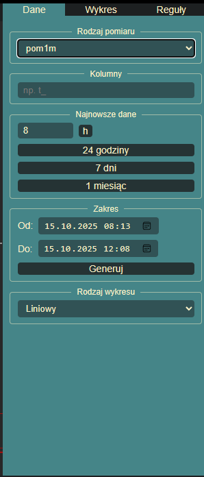
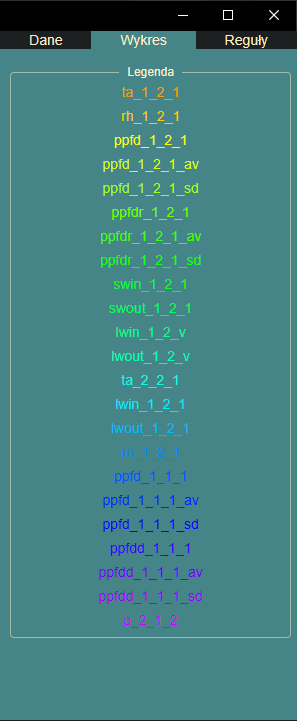
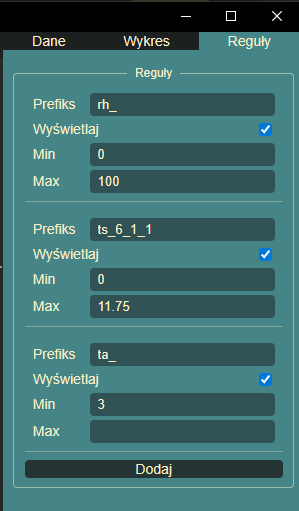

# Meteo-Data-Quality-Monitor

**Interaktywny monitor jakości danych meteorologicznych**  
Aplikacja desktopowa stworzona z myślą o technikach, operatorach i operatorach stacji pomiarowych. Szybka, czytelna i skuteczna kontrola jakości pomiarów w czasie rzeczywistym.


> *Kliknij i przytrzymaj lewy przycisk myszy na wykresie → przeciągnij → puść → zoom gotowy!*

## Poglądowe screeny
  
  
  
  
  
  

## Główne funkcje

- **Zoom przez zaznaczenie** – intuicyjny i błyskawiczny  
- Trzy tryby wykresu: **punktowy • liniowy • słupkowy**  
- Automatyczna, inteligentna siatka czasowa (godziny/dni/tygodnie)  
- **Podgląd wartości pod kursorem** z dokładnością do 4 miejsc  
- **Reguły QC z podświetleniem na czerwono** – natychmiast widzisz błędy  
- Edytowalne reguły w locie (np. `rh_` 0–100%, `ta_` ≥3°C)  
- Obsługa wielu stacji i wielu prefiksów (`pom1m`, `pom30m`, `deszcz`, `raw_` itp.)  
- Legenda z kolorami i nazwami kolumn  
- Szybkie zakresy: 8h • 24h • 7 dni • 1 miesiąc  
- Dowolny zakres dat z wyborem godziny  
- Pasek postępu przy ładowaniu dużych plików  
- Pełna obsługa klawiatury
- Podpowiedzi na wykresie

## Skróty klawiszowe

| Skrót              | Działanie                                   |
|--------------------|---------------------------------------------|
| `Ctrl+1` / `Cmd+1` | Zakładka **Dane**                           |
| `Ctrl+2` / `Cmd+2` | Zakładka **Legenda**                        |
| `Ctrl+3` / `Cmd+3` | Zakładka **Reguły QC**                      |
| `Ctrl+Z` / `Cmd+Z` | Cofnięcie przybliżenia **UNZOOM Wykresu**   |
| `Ctrl+Y` / `Cmd+Y` | Cofnięcie cofnięcia **Return ZOOM Wykresu** |

## Instalacja i uruchomienie

```bash
# 1. Sklonuj repozytorium
git clone https://github.com/chomiczo/Meteo-Data-Quality-Monitor.git
cd Meteo-Data-Quality-Monitor

# 2. Otwórz w środowisku programistycznym (IDE) np. Visual Studio Code cały katalog z projektem.

# 3. Zainstaluj bibliotekę (BARDZO WAŻNE!)
pip install pywebview

# 5. Uruchom!
python -m wmonitor
